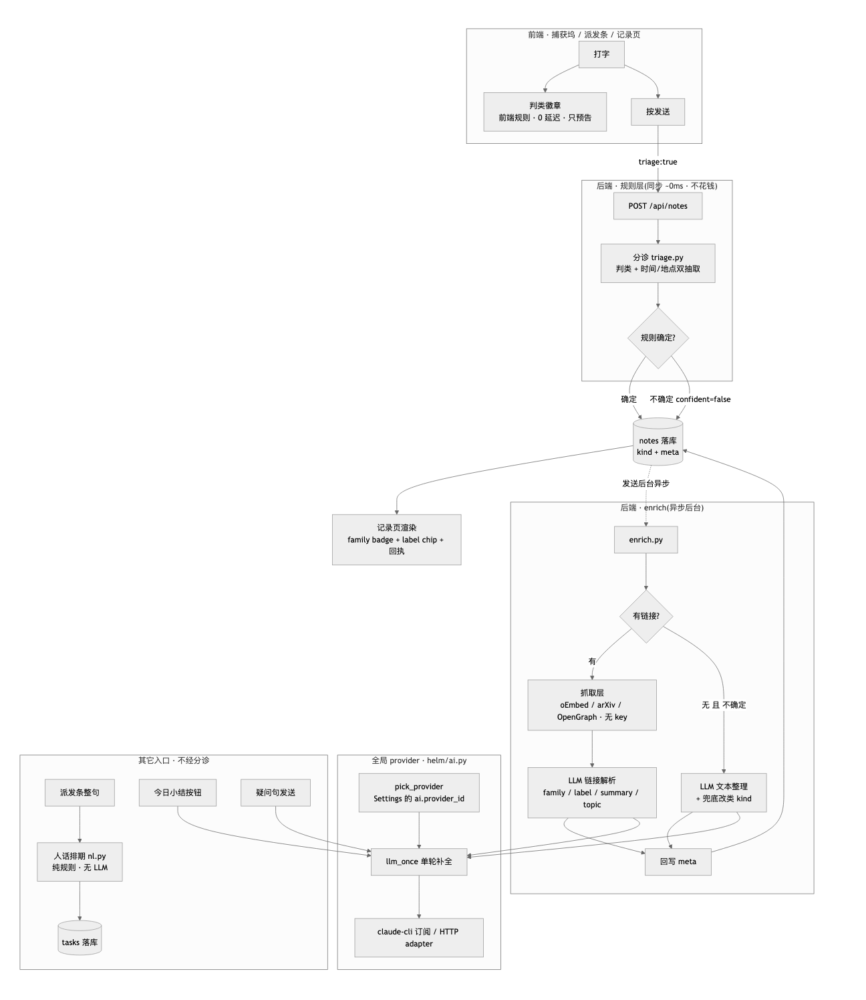
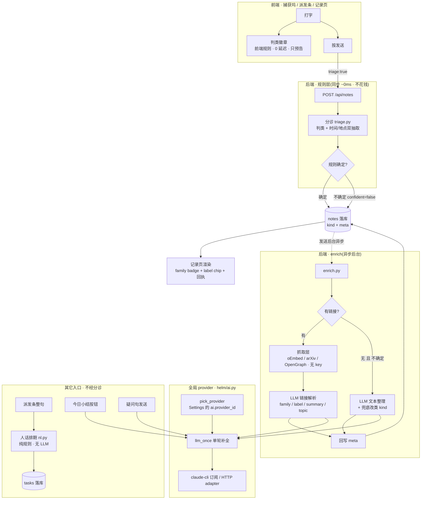

# Helm AI System · 详解(含全部 Prompt + 架构图)

> 2026-07-08 · 对应分支 feat/nomi-kinds(PR #56)。本文覆盖**记录页/捕获坞**的
> AI 管线:分诊、收藏解析(enrich)、链接分类、主题归类、人话排期、今日小结、
> 问大脑。Chat / Research / Mail 各自的 AI 不在此文范围。

---

## 0. 30 秒理解

> **人话:** 你随手往捕获坞里丢一句话或一个链接,Helm 在后台做三件事——
> **秒判这是什么**(速记/想法/任务/日记/收藏)、**抠出关键信息**(时间、地点、
> 是什么类型的链接)、**配上摘要和标签**。能用关键词规则搞定的绝不叫模型(快、
> 免费),规则拿不准的才请大模型兜底。全程不丢你的原文,任何一步失败都优雅降级。

一条速记的完整旅程:



> 上图是渲染好的 PNG(任何查看器都能看)。下面是它的 mermaid 源码(支持 mermaid
> 的编辑器会自动渲染成图;不支持的看上面的 PNG 或再下面的 ASCII 版)。改图时改
> 源码,再重新导出 PNG(见文末「重新生成架构图」)。



同一张图的纯文本版(终端/无渲染时看):

```
用户在捕获坞打字
     │
     ├── 实时 ──> [判类徽章]   前端规则 · 0 延迟 · 只预告 · 不落库
     │
   按发送 (triage:true)
     │
     v
  POST /api/notes
     │
   分诊规则层 triage.py        同步 ~0ms · 不花钱
   判类 + 时间/地点双抽取
     ├── 确定 (confident=true) ─┐
     └── 不确定 (=false) ───────┤ 标记待兜底
                                 v
                        [notes 落库: kind + meta] ──> 记录页渲染
                                 │                    (family badge + label chip + 回执)
                        发送后台异步 enrich.py
                                 │
                       ┌─────────┴──────────┐
                    有链接?              无链接且不确定
                       │                     │
                  抓取层(无 key)        LLM 文本整理
                  oEmbed/arXiv/OG        + 兜底改类 kind
                       │                     │
                  LLM 链接解析               │
                  family/label/summary/topic │
                       └─────────┬───────────┘
                                 v
                          回写 meta ──> [notes 落库]

  所有 LLM 调用 ─> helm/ai.py:  pick_provider ─> llm_once ─> claude-cli 订阅
                 (Settings → AI 一个旋钮 ai.provider_id 全局共用)

  其它入口(不经分诊,直连):
    派发条整句   ─> 人话排期 nl.py(纯规则)─> tasks
    今日小结按钮 ─> llm_once
    疑问句发送   ─> /api/ask ─> llm_once
```

---

## 1. 一张表看全

| 环节 | 触发 | 引擎 | 延迟 | 花钱? |
|---|---|---|---|---|
| 判类徽章(输入时) | 捕获坞打字 | 前端规则 | 0 | 否 |
| 分诊 · 规则层 | 发送(triage:true) | 后端规则 | ~0 | 否 |
| 分诊 · LLM 兜底 | 规则拿不准(confident=false) | 全局 provider | ~15s 异步 | 每条最多 1 次 |
| 收藏解析 · 抓取层 | 速记里有链接 | oEmbed/arXiv API/OpenGraph | 秒级 | 否 |
| 收藏解析 · LLM 层 | 抓取层之后 | 全局 provider | 异步,90s 超时 | 每条 1 次 |
| 链接分类(family/label) | 随 enrich 顺带 | 同上(同一次调用) | — | 0 额外 |
| 主题归类(topic) | 随 enrich 顺带 | 同上(同一次调用) | — | 0 额外 |
| 人话排期 | 派发条打字/提交 | 后端规则 | ~0 | 否 |
| AI 今日小结/周回顾 | 用户点按钮 | 指定 provider | 同步等待 | 用户主动,1 次 |
| 问大脑 | 捕获坞疑问句发送 | 全局 provider | 同步等待 | 1 次 |

**设计原则**:规则先行零延迟、LLM 只兜底和增益、失败必降级、绝不丢用户内容、
不确定就标记而不是编造。

---

## 2. 全局底座(helm/ai.py)

> **人话:** 所有"顺手帮你整理"的 AI(分诊兜底、摘要、问大脑…)都从**同一个
> 开关**取模型。你在设置里选一次,全都用它,不用到处配 key。你现在用的是自己
> 的 Claude 订阅,走本机 CLI,不额外计费。

所有非 Chat 的 AI 功能走同一个旋钮:Settings → AI 的 `ai.provider_id`
(没设就用第一个已配置的 provider)。当前你配的是 **Claude Code 订阅 CLI**
(`claude-cli` 类型,base_url 存二进制路径)——走订阅,不烧 API key。

`llm_once(system, user)`:单轮补全,流式折叠成字符串;claude-cli 与 HTTP
adapter(OpenAI/Anthropic 兼容)共用同一接口,所以换 provider 上层无感。

---

## 3. 分诊管线(T1,helm/notes/triage.py + enrich 兜底)

> **人话:** 你丢进来一句话,系统先像"邮件自动分文件夹"那样用关键词秒判:这是
> 随手记、一个想法、要做的事、今天的日记,还是个收藏链接?判成"要做的事"的,
> 还顺手把"明晚8点""在家"这种时间地点抠出来。关键词拿不准的少数,才丢给大模型
> 定夺。你嫌判错了,点一下就能改,后端会记下这次结果。

### 3.1 触发

`POST /api/notes` 带 `"triage": true`(捕获坞自动挡;手动改类的客户端传显式
`kind`、不传 `triage`,完全绕过分诊)。

### 3.2 规则层(同步,~0ms)

判类顺序(与设计稿 demo / 前端徽章同一套口径,**后端为准**;谁先命中谁赢):

```
1. 链接(https?://)      → note(收藏,交 enrich 接手)   confident=true
2. 任务词                → task(自动进「待办·给自己」)  confident=true
3. 想法词                → idea                          confident=true
4. 叙事词 且 len>14      → journal(journal_date=今天)   confident=true
5. 其余                  → note,标 confident=false ← 等 LLM 兜底
```

顺序有意义:"要不要明天问一下作者"同时含想法词和任务词,任务(第 2)在想法
(第 3)之前,所以判**任务**。

- 任务触发词:`明早|明晚|今晚|明天|后天|下周|点前|之前完成|每天|每周|每月|提醒|记得|别忘|截止|deadline`
- 想法触发词:`也许|或许|说不定|要不要|想到|点子|灵感|如果…就|可以试试`
- 日记触发词:`今天|终于|感觉|开心|难受|累|复盘|想了想|反思`

**双抽取**(所有类别都做):
- 时间 `parse_when`:明早/明晚/今晚/明后天/周X/下周X/X点前/裸钟点/每天…
  → 人话标签 `meta.when`(如「明晚 20:00」)+ 可解析的绝对时刻 `meta.due`
  (本地 ISO,前端 24h 临近橙 chip 用);「每…」识别为 recurring(排期地基)。
  上/下午/晚上修饰自动 +12(「明晚8点」= 20:00)。解析不出 → 不编造,置空。
- 地点 `parse_where`:`在X` / `@X`,懒匹配 + 动词边界前瞻(「在家帮…」只取
  「家」),`现/正/存/实在` 不算地点;抽不出边界宁可放弃。

响应带结构化回执块(前端 toast 用):
```json
"triage": {"kind":"task","when":"明晚 20:00","where":"家","due":"2026-07-09T20:00:00","recurring":false,"confident":true}
```
`meta.triage = {"by":"rule","confident":…}` 记录判定来源。

### 3.3 LLM 兜底(异步,挂在 enrich 里)

> **人话:** 只有规则"没把握"的那几条,才在后台悄悄问一次大模型"这到底该归哪
> 类",大约 15 秒后把结果补上。你在这期间自己改过类,它不会覆盖你。

只有 `confident=false` 的速记,enrich 的文本整理 prompt 顺带让 LLM 判 `kind`
(见 §4 的 TEXT prompt,含 `"kind"` 字段)。写回规则:

- LLM 判 `idea|task|journal` → **升格** kind(journal 补 journal_date),
  `meta.triage = {"by":"llm","confident":true}`;
- LLM 判 `note` → 确认速记,同样标 `by:llm`(不留 pending);
- 只从 `kind=note` 升格——用户在 enrich 期间手动改过类,LLM 不覆盖;
- LLM 失败/超时/没配 provider → 保持规则结果,内容不丢。

实测(claude-cli):~15s 写回;「把 nomi-reference 的截图整理进仓库」规则
拿不准 → LLM 升格 task,自动进待办。

### 3.4 纠错回流

> **人话:** 判错了,回执上点「改」、卡片右上角 ⋯ 菜单、详情页,都能一键改类。

统一走 `PATCH /api/notes/{id} {"kind":…}`;改成 journal 自动补 journal_date。
「分诊记住纠正」(用你的纠正样本做个性化)在 backlog `[T1+]`,未实现。

---

## 4. 收藏解析 enrich(helm/notes/enrich.py)

> **人话:** 你贴个链接进来,后台默默去把那个网页/视频/论文抓回来,配上标题、
> 封面、两三句中文摘要和标签——像给收藏自动做卡片,你一个字都不用写。抓不到就
> 退成一张裸链接卡,绝不因为一个链接卡住你发送。

速记发送后台跑,三层逐层降级,任何一步失败都不影响已落库的原文:

1. **抓取层(无 key)**:YouTube → 官方 oEmbed;arXiv → export API(Atom);
   其余 → 页面 OpenGraph / `<title>`(截 512KB,8s 超时)。多链接各抓一份存
   `meta.links[]`,顶层字段=第一个(向后兼容)。抓取结果**先落库**——卡片先
   有标题/封面,LLM 再慢也不拖累展示。
2. **LLM 层**(全局 provider,90s 超时,失败保留第一层):补分类(family/label)、
   摘要、标签、主题(见下方 prompt)。
3. **全失败** → meta 至少 `{type, url}`,卡片仍显示裸链接。

**meta 合并规则**:enrich 从不覆盖分诊的规则种子(when/where/due 优先,
LLM 只补空)。

### Prompt 原文 · 链接类(_LINK_SYSTEM)

`%s` 处运行时注入库里已有 label 列表(去重,上限 40;空则"暂无"):

```
你是 Helm 的收藏解析器。根据给出的链接元数据(可能不全)输出 JSON:
{"family":"video|paper|design|link",
"label":"2-6字中文规范类别,给最泛化的那层,不带来源/子类修饰(YouTube视频/B站视频→视频;数学论文/AI论文→论文;职位/岗位→招聘)。优先复用已有类别:%s;没有再造一个同样泛的词",
"summary":"2-3 句中文,讲清这是什么、为什么值得看",
"tags":["≤3个中文短标签"],
"topic":"2-6字的主题集合名(如 Transformer 学习/设计灵感),不确定给 null"}。
family:video=视频,paper=论文/文献,design=UI·UX·设计·作品集,其余一律 link。只输出 JSON。
```

user 消息形如:`链接: {url}\n元数据: {抓取层 JSON}\n用户原话: {content}`

### Prompt 原文 · 纯文本类(_TEXT_SYSTEM,含分诊兜底)

无链接的速记走这个;`"kind"` 字段就是 §3.3 的分诊兜底:

```
你是 Helm 的速记整理器。把用户随手记的一条整理成 JSON:
{"title":"≤12字标题","tags":["≤3个中文短标签"],"when":"文中提到的时间线索,无则null",
"where":"文中提到的地点线索,无则null",
"topic":"2-6字的主题集合名(把相关记录归到同一集合,如 Transformer 学习),不确定给 null",
"kind":"note|idea|task|journal 之一——task=要做的事(常带时间),idea=点子/假设,
journal=当天叙事,其余 note"}。
不改写原文,只输出 JSON。
```

解析容错:从回复里正则抠第一个 `{...}`,坏 JSON 一律当空处理(不炸管线)。

---

## 5. 链接分类三层(F1,2026-07-08 用户拍板)

> **人话:** 一个链接要同时回答两个问题——"这卡片长什么样"(有限几种视觉就够)
> 和"这到底是什么"(招聘?仓库?餐厅?世界上无穷种)。硬塞进一个字段会打架:
> 枚举太窄不够用,全自由又会冒出"YouTube视频/B站视频/教学视频"一堆近义词。所以
> 拆成三层,各管一件事、各有各的防失控办法。

| 层 | 谁定 | 防爆炸机制 | 用途 | 值域 |
|---|---|---|---|---|
| **family** 视觉族 | LLM 4 选 1 | 死枚举(永不增长) | 卡片 badge 图标/颜色 | `video｜paper｜design｜link` |
| **label** 规范类别 | LLM,优先复用 | 归一化规则 + 已有集合注入 | 卡上"这是什么"chip | 自由中文,但收敛 |
| **topic** 主题集合 | LLM,优先复用 | 已有集合注入(现有机制) | 跨条目聚成集合 | 自由中文 |

- **family** 只管卡长什么样,所以只需 4 个稳定视觉族;任何链接兜底 `link`(中性
  灰),前端永远画得出,不再 fallback 到无意义的 "WEB"。
- **label** 是精确类型("招聘""仓库""餐厅"),但**强制归一化到最泛那层**(不带
  来源/子类修饰),且 prompt 注入库里**已有的 label 列表**让 LLM 优先复用——
  类别集合从真实数据里自举收敛,不靠预设枚举。后端再留一张极简 alias 表兜最常见
  同义(YouTube视频/B站视频→视频、岗位/职位→招聘、GitHub仓库/开源项目→仓库)。
- **label 与 topic 正交**:同一招聘链接 label=招聘(是什么种类)、topic=求职
  (关于什么),互不干扰。

**实测**(真 LLM):GitHub 仓库链接 → family=`link`、label=`仓库`、topic=`前端
框架`;arXiv → family=`paper`(badge「论文」)。原来那个无意义的 "WEB" 变成了
「链接/视频/论文/设计」+ 精确类别 chip。

向后兼容:旧字段 `type`(youtube/paper/inspiration/article)保留不删,旧前端 /
notch 继续读;新前端优先读 family/label,老数据无 family 时按 type 推
(`famOf()`:youtube→video、paper→paper、inspiration→design、article→link)。

---

## 6. 主题归类 topic(集合)

> **人话:** 除了"这是什么种类",AI 还顺手给每条记录标一个"主题"(比如都跟
> Transformer 有关的归到「Transformer 学习」)。攒够几条相似的,页面就会提议
> "要不要建个集合?"。这一步不额外花钱,是上面解析时一起产出的。

`meta.topic` 就是 §4 两个 prompt **顺带产出**的(零额外调用)。前端「按主题·AI」
分区;卡上主题胶囊 × = 整份 meta 回写移出集合;同一未确认主题攒够 3 条 →
涌现「建一个集合?」建议卡(确认/忽略记 localStorage)。topic 的"优先复用已有
集合"机制,正是 §5 label 收敛借鉴的原型。

---

## 7. 人话排期(T2,helm/tasks/nl.py)· 纯规则,无 LLM

> **人话:** 你像跟人说话一样写"每天早上9点汇总未读邮件",系统直接听懂排期,
> 你不用去学 cron 那种 `0 9 * * *` 天书。边打字边显示解析出的时间,纯规则,免费。

`POST /api/tasks {prompt}` 整句(或 to-task 的 `schedule_nl`)→ 解析:

| 人话 | schedule | 例 |
|---|---|---|
| 每天[早上N点/晚上N点] | cron `M H * * *` | 每天 09:00 |
| 每周X / 每星期X | cron `M H * * 0-6` | 每周五 15:00 |
| 每周(没说哪天) | cron 周一(注明可纠) | 每周一 09:00 |
| 每个工作日 | cron `M H * * 1-5` | 工作日 08:30 |
| 每月N号 | cron `M H N * *` | 每月 1 号 09:00 |
| 每 N 小时/分钟 | every {seconds} | 每 6 小时 |
| 一次性(明早9点/周五下午3点…) | at(复用 §3.2 parse_when,本地→带时区 ISO) | 明早 09:00 |

原句留在 `task.prompt`,人话标签存 `schedule_value.nl`(UI 只显示人话,cron
表达式退场);`GET /api/tasks/parse?q=` 给派发条实时徽章——与提交同一解析器,
不双轨。解析不出 → 422 带提示「把『什么时候』放进句子」(不猜;要不要改成
「没时间=立即执行一次」在 backlog `Q-T2` 待拍板)。

---

## 8. AI 今日小结 / 周回顾(helm/notes/summary.py)

> **人话:** 一天写了好几段日记,点一下让 AI 揉成 2-4 句要点 + 情绪基调,不用你
> 自己复盘。这是你主动点才花一次调用的。

用户主动点按钮才调用(付费动作用户可控),provider/model 由请求指定。
`days=1` 当日小结,`days=7` 周回顾;可选把小结存回日记(source=agent)。

### Prompt 原文(SUMMARY_PROMPT)

```
为下面这一天的日记条目写一段简洁的「今日小结」(2-4 句,中文),提炼当天要点、进展与情绪基调,不要逐条复述。

日记条目:
{entries}

只输出小结正文,不要前缀。
```

多条目以 `\n---\n` 拼接填入 `{entries}`。

---

## 9. 问大脑(helm/chat/routes.py `/api/ask`)

> **人话:** 随手打个问句(带问号或"为什么/怎么"开头),直接当场问、当场答,
> 不用切去对话页专门开个会话。

捕获坞判定疑问句(`为什么/怎么/如何/…` 开头或 `?/?` 结尾)→ 发送走
`/api/ask`,同步等答案,答案就地显示在坞下方(notch 同契约)。

### Prompt 原文(system)

```
用中文简洁回答,直接给答案,不用客套。
```

---

## 10. 成本与降级一览

> **人话:** 能用规则算的绝不叫模型,所以大部分动作是免费即时的;真正花调用的
> 只有"规则拿不准""解析链接内容""你主动点小结/问大脑"这几处。而且任何一环挂了
> 都往下退一档,永远不会丢你的内容、不会卡住你发送。

- **会花钱的**:LLM 兜底(每条不确定速记 1 次)、enrich LLM 层(每条带内容的
  速记 1 次)、今日小结(点一次 1 次)、问大脑(问一次 1 次)。当前 claude-cli
  订阅 = 不额外计费。
- **永远不花钱**:输入徽章、分诊规则层、双抽取、人话排期、抓取层、family 默认、
  主题分区渲染。
- **降级链**:没配 provider → 全部规则结果照常;LLM 超时/坏 JSON → 保留上一层;
  抓取失败 → 裸链接卡。任何失败都不丢内容、不阻塞发送。

---

## 11. 已知边界(诚实声明)

- 输入时的实时徽章是**前端规则**(为了零延迟),后端才是权威——两边规则同口径,
  但以落库结果为准。
- LLM 兜底每条只跑一次,不重试不轮询;判错靠回执「改」纠正。
- **登录墙站点**(LinkedIn 等)抓取层常拿不到标题/摘要——label 还能靠 URL 给出
  「招聘」,但 summary 会偏空。专门的带鉴权抓取未做。
- 「分诊记住纠正」(个性化)未实现 → backlog `[T1+]`。
- 无时间的 agent 任务默认 422 → backlog `Q-T2` 待拍板。
- notch journalToday 按 createdAt 归日、主 app 按 journal_date——凌晨补写归属
  有差,已通知 notch 线对齐(docs/loops/nomi-notch/backlog.md)。

---

## 附:文件地图

| 功能 | 文件 |
|---|---|
| 全局 provider | `helm/ai.py` |
| 分诊规则 + 双抽取 | `helm/notes/triage.py` |
| enrich(抓取+LLM+分类+兜底) | `helm/notes/enrich.py` |
| 今日小结 | `helm/notes/summary.py` |
| 人话排期 | `helm/tasks/nl.py` |
| 问大脑 | `helm/chat/routes.py` |
| 前端捕获坞/徽章 | `frontend/src/lib/CaptureDock.svelte` |
| 前端 family/label 渲染 | `frontend/src/lib/notes/notesStore.svelte.ts`(famOf/FAM_BADGE)、`JournalView.svelte` |

## 附:重新生成架构图

图片 `ai-system-arch.png` 由 §0 的 mermaid 源码渲染。改了源码后重出 PNG:把
mermaid 块喂给任意 mermaid 渲染器(mermaid.live、`@mermaid-js/mermaid-cli` 的
`mmdc -i in.mmd -o ai-system-arch.png -t neutral -w 1200`,或浏览器里
`mermaid@11` + `theme:'neutral'` 截图),覆盖同名文件即可。PNG 与 mermaid 源码、
ASCII 三者是同一张图,改动要三处同步。
